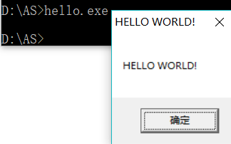
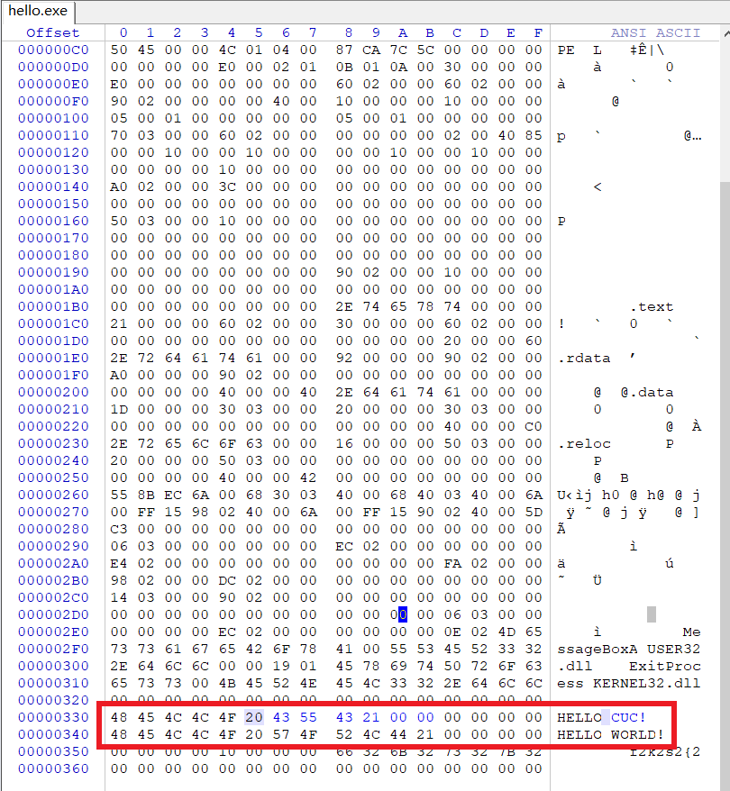
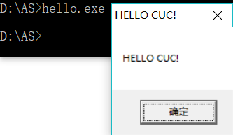

# 软件与系统安全 实验1
## 一、实验内容
* 编写一个release版本的 hello world 程序。通过修改程序可执行文件的方式（不是修改源代码），使得程序运行后显示的内容不为hello world，变成 hello cuc！
## 二、实验过程
1. 编写一个简单的c程序脚本hello.c，如下所示
    ```c
    # include<windows.h>
    int main()
    {
        MessageBox(NULL, "HELLO WORLD!", "HELLO WORLD!", NULL);
        ExitProcess(0);
    }
    ```
2. 在命令行中编译hello.c，使用如下命令：
    ```bash
    # /c表示只编译不运行
    # /Od表示禁止优化

    cl /c /Od hello.c
    ```
    编译生成hello.obj文件。
3. 链接hello.obj，使用如下命令：
    ```bash
    # 指定入口函数为main函数
    # 去掉默认配置库
    # 添加MessageBoxA函数依赖的user32.lib库和ExitProcess函数依赖的kernel32.lib库

    link /nologo /ENTRY:main /NODEFAULTLIB /SUBSYSTEM:WINDOWS user32.lib kernel32.lib /ALIGN:16
    ```
    

4. 查看生成的可执行文件大小，为880字节。

    

    运行：

    


5. 用WINHEX修改可执行文件hello.exe：

    找到HELLO WORLD!字段，直接修改为HELLO CUC!，这里将标题和正文都修改了，多出的字段找到左侧对应的十六进制表示，全修改为0，保存即可。
    
    


6. 再次运行hello.exe，实验成功。

    
