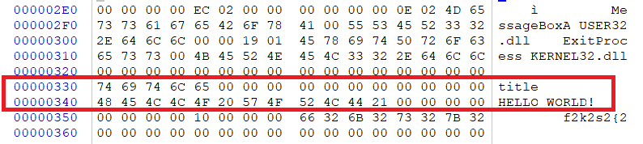
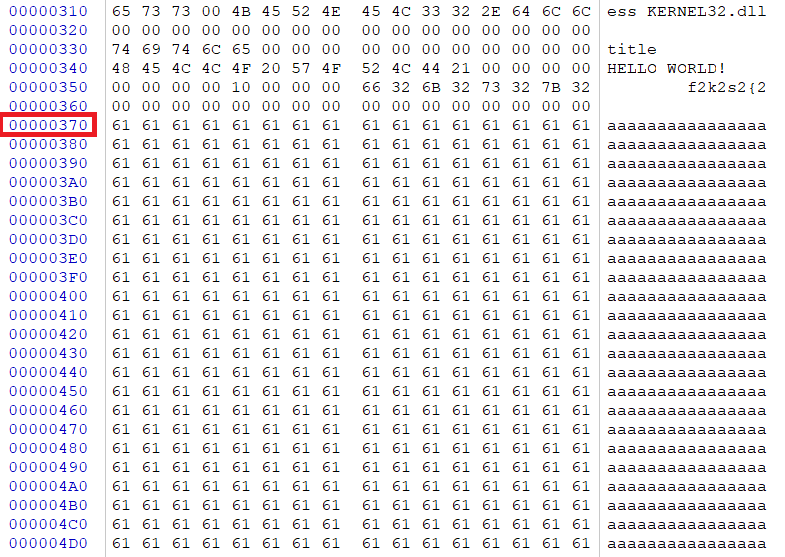
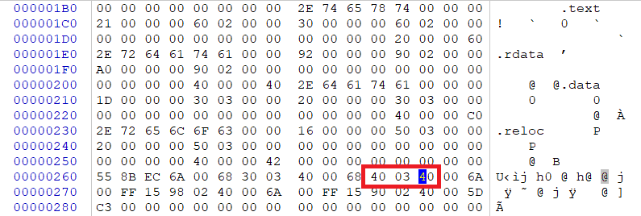
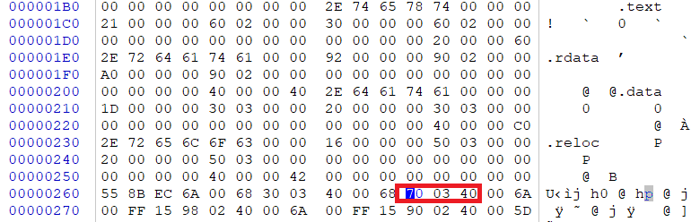

# 软件与系统安全 实验2
## 一、实验内容
* 上一题的程序中，修改的显示内容变为一个很长的字符串（至少2kb长）。并且保证程序正常运行不崩溃。
* 提示，可执行文件中原有的空间有限，必须要新加入数据，加入数据后必须要修改.text字段中的指针。

## 二、实验过程
1. 定位可执行文件中代码与数据在内存中的位置
    
    在命令行中使用如下命令：
    ```bash
    dumpbin /all hello.exe
    ```
    这里摘录部分输出：
    ```
    OPTIONAL HEADER VALUES
             10B magic # (PE32)
           10.00 linker version
              30 size of code
              E0 size of initialized data
               0 size of uninitialized data
             260 entry point (00400260)
             260 base of code
             290 base of data
          400000 image base (00400000 to 0040036F)

    SECTION HEADER #1
   .text name
      21 virtual size
     260 virtual address (00400260 to 00400280)
      30 size of raw data
     260 file pointer to raw data (00000260 to 0000028F)
       0 file pointer to relocation table
       0 file pointer to line numbers
       0 number of relocations
       0 number of line numbers

    SECTION HEADER #2
    .rdata name
      92 virtual size
     290 virtual address (00400290 to 00400321)
      A0 size of raw data
     290 file pointer to raw data (00000290 to 0000032F)
       0 file pointer to relocation table
       0 file pointer to line numbers
       0 number of relocations
       0 number of line numbers
    ```
    由输出可知，程序基地址为`00400000`, `00400260 to 00400280`为代码段，`00400290 to 00400321`为数据段。

2. 反汇编
    ```bash
    dumpbin /disasm hello.exe
    ```
    部分输出如下：
    ```
    File Type: EXECUTABLE IMAGE

    00400260: 55                 push        ebp
    00400261: 8B EC              mov         ebp,esp
    00400263: 6A 00              push        0
    00400265: 68 30 03 40 00     push        400330h
    0040026A: 68 40 03 40 00     push        400340h
    0040026F: 6A 00              push        0
    00400271: FF 15 98 02 40 00  call        dword ptr ds:[00400298h]
    00400277: 6A 00              push        0
    00400279: FF 15 90 02 40 00  call        dword ptr ds:[00400290h]
    0040027F: 5D                 pop         ebp
    00400280: C3                 ret

    Summary

            20 .data
            A0 .rdata
            20 .reloc
            30 .text
    ```
    其中push之后的是输出的标题和正文内容

    `400330h`->`title`

    `400340h`->`HELLO WORLD!`

    则`title`地址为400330h-400000h=330h，`HELLO WORLD!`地址为400340h-400000h=340h。

    打开Winhex查看，与上述结果一致。

    

3. 在文件末尾添加内容

    

4. 找到.text字段中的指针并替换

    

    将.text字段中指向`HELLO WORLD！`的指针指向`400340h`修改为新增加内容的地址`400370h`，保存。

    

    再次运行程序

    

    实验成功。


