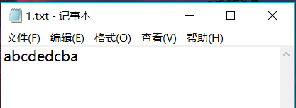
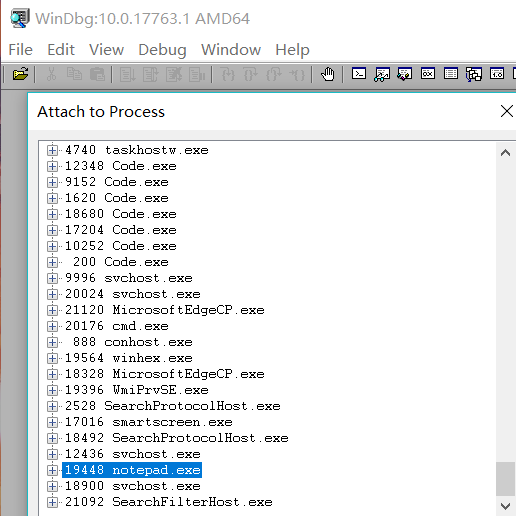
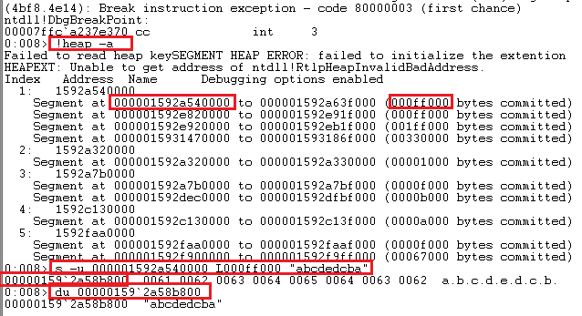
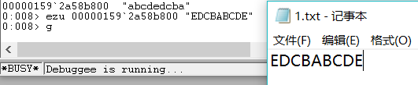

# 软件与系统安全 实验3
## 一、实验内容
* 在notepad（32位64位均可）中，输入一段文字。然后使用调试器，在内存中修改这段文字。使得没有在界面操作notepad的修改文字的情况下。notepad中显示的文字变化。
* 提示，在调试器中定位控件缓存的内存地址，可以用搜索、逆向、消息截获分析、API截获分析等方法。

## 二、实验过程
1. 新建文本文件如下

    

2. 使用Windbg对其进行处理

    * 打开文件找到notepad.exe

    

    Windbg中用到的查找命令如下:
    ```bash
    # 查找所有堆
    !heap -a

    # 堆中查找指定字符串
    s -u 000001592a540000 L000ff000 "abcdedcba"

    # 显示Unicode
    du 00000159`2a58b800
    ```

    

3. 修改操作
* 用到的Windbg命令如下
    ```bash
    # 使用ezu向已知内存地址中写入指定字符串
    ezu 00000159`2a58b800 "EDCBABCDE"

    # 运行
    g
    ```
    运行结果：

    

    可见notepad中内容已修改，实验成功。
