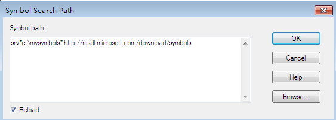
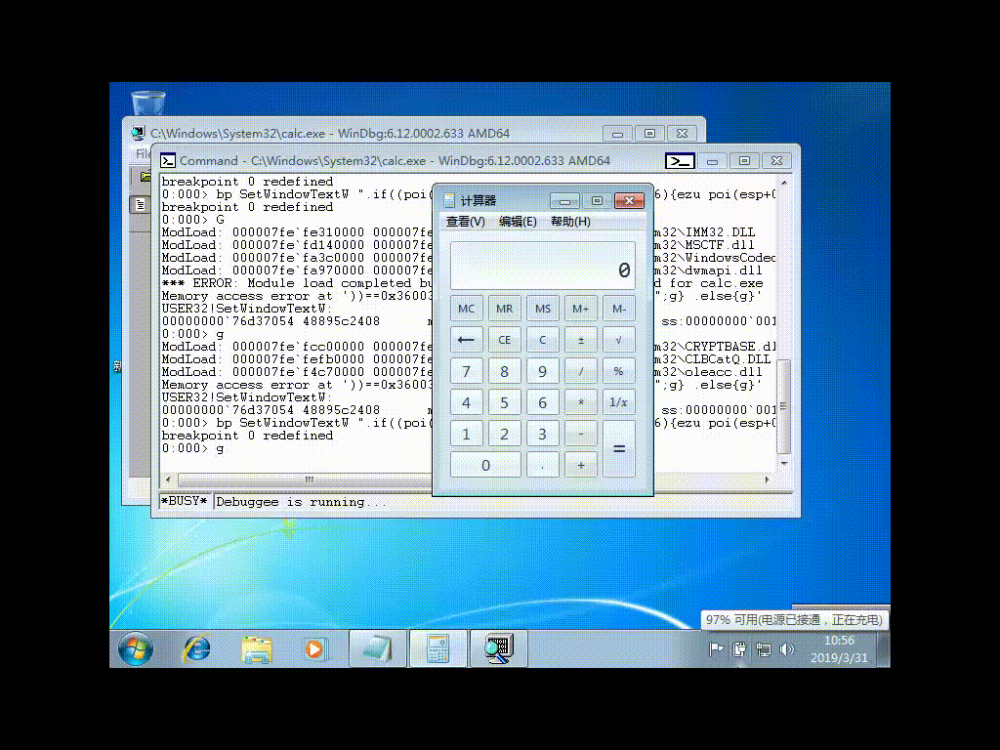

# 软件与系统安全 实验4
## 一、实验内容

* 通过调试器监控计算器程序的运行，每当运行结果为666时，就改为999。
* 提示：找到运行结果在内存中保存的地址。监控 “=” 按键消息等。

## 二、实验过程
### 1. 环境配置
* 由于win10中未找到`SetWindowTextW`这个API，故选择在virtualbox虚拟机中安装win7系统来进行实验。
* win7系统（64bit）中安装windbg（64bit）
    * 提供一个[windbg下载链接](http://download.microsoft.com/download/A/6/A/A6AC035D-DA3F-4F0C-ADA4-37C8E5D34E3D/setup/WinSDKDebuggingTools_amd64/dbg_amd64.msi)，亲测可用。
### 2. windbg使用
* windbg中打开calc.exe
    * `file`-`Open Executable`-选中`c:/windows/system32/calc.exe`
* 下载并安装符号表
    * `file`-`symbol file path`-写入`SRV*c:\mysymbols* http://msdl.microsoft.com/download/symbols`，并勾选`reload`,点击`OK`。

        
* 新建执行脚本dbg.txt
    * 写入待执行命令如下：
        ```bash
        #新定义一个别名为name 将 poi（esp+0x8）处的 unicode字符串取出
        as /mu ${/v:name} poi(esp+0x8)  

        #进行字符串比较，如果name和666相同，就改为 999，否则输出name
        .if($scmp(@"${name}","666")==0){ezu poi(esp+0x8) "999";}.else{.echo ${name};}

        #程序继续运行
        g
        ```
* 执行脚本
    * `bp SetWindowTextW "$<C:\\dbg.txt"`
    * 继续运行：`g`
* 运行结果

    


